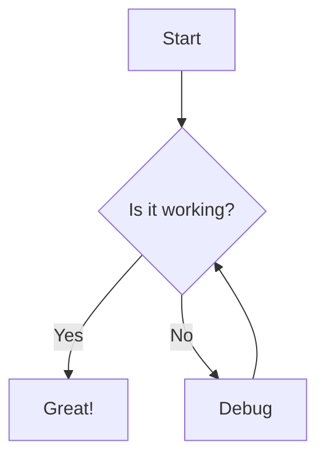

# Web Mermaid Support Implementation Plan

> **For agentic workers:** REQUIRED SUB-SKILL: Use superpowers:subagent-driven-development (recommended) or superpowers:executing-plans to implement this plan task-by-task. Steps use checkbox (`- [ ]`) syntax for tracking.

**Goal:** Add full interactive mermaid diagram rendering to the web share page, matching the desktop app experience.

**Architecture:** Add `@opencode-ai/session-ui` as a dependency to the web package, export the mermaid module and CSS from session-ui, then modify the `ContentMarkdown` component to detect mermaid code blocks and call the existing `renderMermaidDiagrams` function after DOM updates.

**Tech Stack:** SolidJS, marked, shiki, mermaid, session-ui

## Global Constraints

- Reuse existing mermaid rendering logic from `packages/session-ui`
- Match desktop app's interactive features (zoom, pan, fullscreen, download, copy)
- No duplication of mermaid rendering code

---

### Task 1: Add Dependencies and Exports

**Files:**
- Modify: `packages/web/package.json`
- Modify: `packages/session-ui/package.json`

**Interfaces:**
- Consumes: Nothing (setup task)
- Produces: session-ui dependency available in web package, mermaid module and CSS exported from session-ui

- [ ] **Step 1: Add session-ui dependency to web package**

Open `packages/web/package.json` and add `@opencode-ai/session-ui` to the dependencies section:

```json
{
  "dependencies": {
    "@opencode-ai/session-ui": "workspace:*",
    // ... existing dependencies
  }
}
```

- [ ] **Step 2: Add mermaid exports to session-ui package**

Open `packages/session-ui/package.json` and add two new exports to the exports map:

```json
{
  "exports": {
    "./*": "./src/components/*.tsx",
    "./mermaid": "./src/components/mermaid.ts",
    "./mermaid.css": "./src/components/mermaid.css",
    // ... existing exports
  }
}
```

- [ ] **Step 3: Install dependencies**

Run from the repository root:

```bash
bun install
```

Expected: Dependencies installed successfully, no errors.

- [ ] **Step 4: Verify exports are accessible**

Run from `packages/web`:

```bash
bun typecheck
```

Expected: No type errors. The new exports should be resolvable.

- [ ] **Step 5: Commit**

```bash
git add packages/web/package.json packages/session-ui/package.json
git commit -m "feat(web): add session-ui dependency for mermaid support"
```

---

### Task 2: Integrate Mermaid Rendering in ContentMarkdown

**Files:**
- Modify: `packages/web/src/components/share/content-markdown.tsx:1-74`

**Interfaces:**
- Consumes: `renderMermaidDiagrams` from `@opencode-ai/session-ui/mermaid`, mermaid CSS from `@opencode-ai/session-ui/mermaid.css`
- Produces: ContentMarkdown component that renders mermaid diagrams with full interactivity

- [ ] **Step 1: Import mermaid dependencies**

At the top of `packages/web/src/components/share/content-markdown.tsx`, add these imports:

```ts
import { renderMermaidDiagrams } from "@opencode-ai/session-ui/mermaid"
import "@opencode-ai/session-ui/mermaid.css"
import { createEffect } from "solid-js"
```

- [ ] **Step 2: Update markedShiki highlight callback to detect mermaid**

Find the `markedShiki` configuration (around line 18-28) and update the `highlight` function:

```ts
const markedWithShiki = marked.use(
  {
    renderer: {
      link({ href, title, text }) {
        const titleAttr = title ? ` title="${title}"` : ""
        return `<a href="${href}"${titleAttr} target="_blank" rel="noopener noreferrer">${text}</a>`
      },
    },
  },
  markedShiki({
    highlight(code, lang) {
      if (lang === "mermaid") {
        const encoded = encodeURIComponent(code)
        return `<div data-component="mermaid-diagram" data-mermaid-content="${encoded}"></div>`
      }
      return codeToHtml(code, {
        lang: lang || "text",
        themes: {
          light: "github-light",
          dark: "github-dark",
        },
      })
    },
  }),
)
```

- [ ] **Step 3: Add effect to call renderMermaidDiagrams after DOM update**

Inside the `ContentMarkdown` component function, after the `html` resource is created, add an effect that watches the resource state and calls `renderMermaidDiagrams`:

```ts
export function ContentMarkdown(props: Props) {
  const [html] = createResource(
    () => strip(props.text),
    async (markdown) => {
      return markedWithShiki.parse(markdown)
    },
  )
  const [expanded, setExpanded] = createSignal(false)
  const overflow = createOverflow()
  const messages = useShareMessages()

  createEffect(() => {
    if (html.state === "ready" && overflow.ref) {
      queueMicrotask(() => renderMermaidDiagrams(overflow.ref))
    }
  })

  // ... rest of component
}
```

- [ ] **Step 4: Verify type checking passes**

Run from `packages/web`:

```bash
bun typecheck
```

Expected: No type errors.

- [ ] **Step 5: Commit**

```bash
git add packages/web/src/components/share/content-markdown.tsx
git commit -m "feat(web): render mermaid diagrams in share page"
```

---

### Task 3: Manual Testing and Verification

**Files:**
- None (testing task)

**Interfaces:**
- Consumes: Working mermaid integration from Tasks 1-2
- Produces: Verified functionality

- [ ] **Step 1: Start the web dev server**

Run from `packages/web`:

```bash
bun dev
```

Expected: Dev server starts, typically at `http://localhost:4321`.

- [ ] **Step 2: Create a test session with mermaid diagram**

Create or use an existing shared session that contains a mermaid code block. Example:

````markdown
Here's a flowchart:


````

- [ ] **Step 3: Verify diagram renders as SVG**

Navigate to the share page for the test session. The mermaid code block should render as an SVG diagram, not as plain code.

Expected: Flowchart diagram is visible with nodes and arrows.

- [ ] **Step 4: Test zoom and pan**

- Hover over the diagram and use mouse wheel to zoom in/out
- Click and drag to pan the diagram

Expected: Zoom and pan work smoothly.

- [ ] **Step 5: Test fullscreen mode**

Click the fullscreen button (should appear on hover). The diagram should open in a fullscreen overlay.

Expected: Fullscreen overlay appears with the diagram. Press Escape or click close to exit.

- [ ] **Step 6: Test download SVG**

Click the download button. An SVG file should be downloaded.

Expected: `mermaid-diagram.svg` file is downloaded.

- [ ] **Step 7: Test copy source**

Click the copy button. The mermaid source code should be copied to clipboard.

Expected: Source code is copied (verify by pasting elsewhere).

- [ ] **Step 8: Test error handling**

Add a mermaid block with invalid syntax:

````markdown
```mermaid
this is not valid mermaid syntax
```
````

Expected: An error bar appears with the error message, and the raw code is displayed as a fallback.

- [ ] **Step 9: Test multiple diagrams**

Add multiple mermaid blocks to the same session.

Expected: All diagrams render correctly and independently.

- [ ] **Step 10: Verify no regressions**

Check that regular code blocks (non-mermaid) still render with syntax highlighting.

Expected: Code blocks show proper syntax highlighting as before.

- [ ] **Step 11: Final commit (if any fixes were needed)**

If any fixes were made during testing:

```bash
git add .
git commit -m "fix(web): address issues found during mermaid testing"
```
